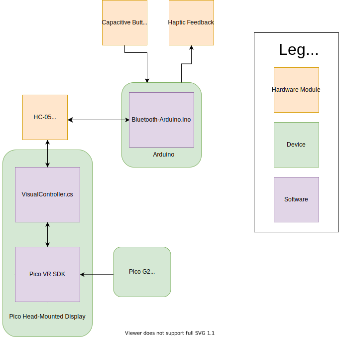
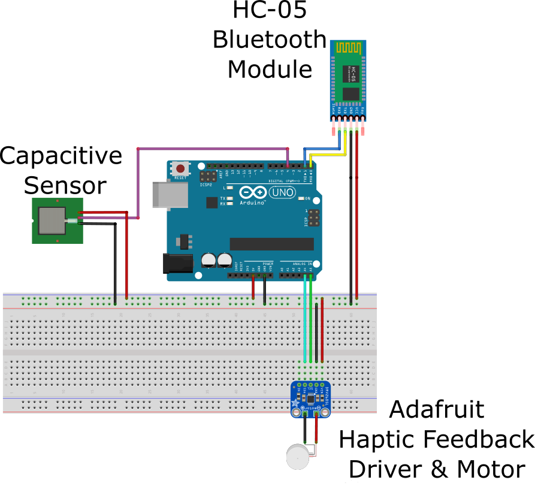
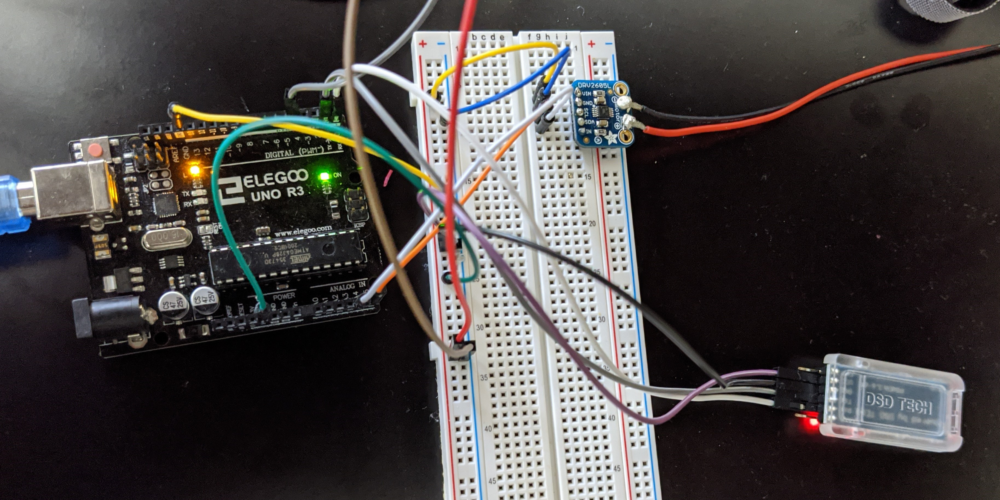
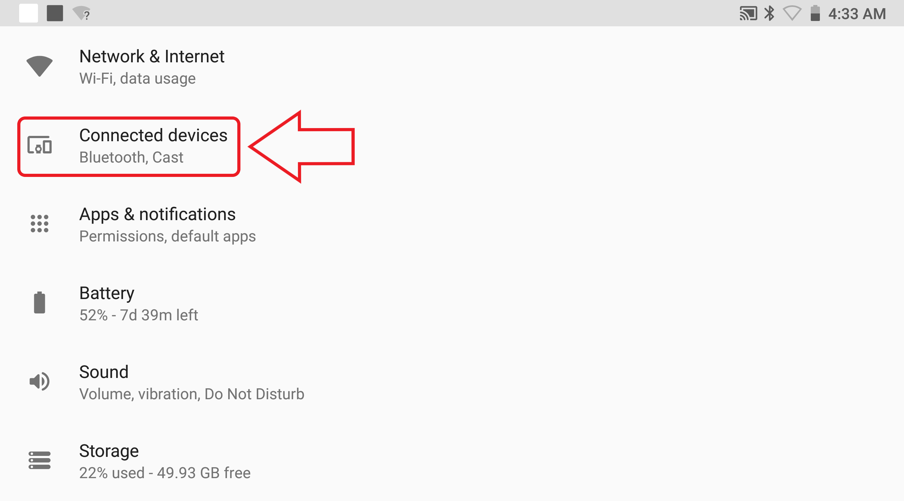
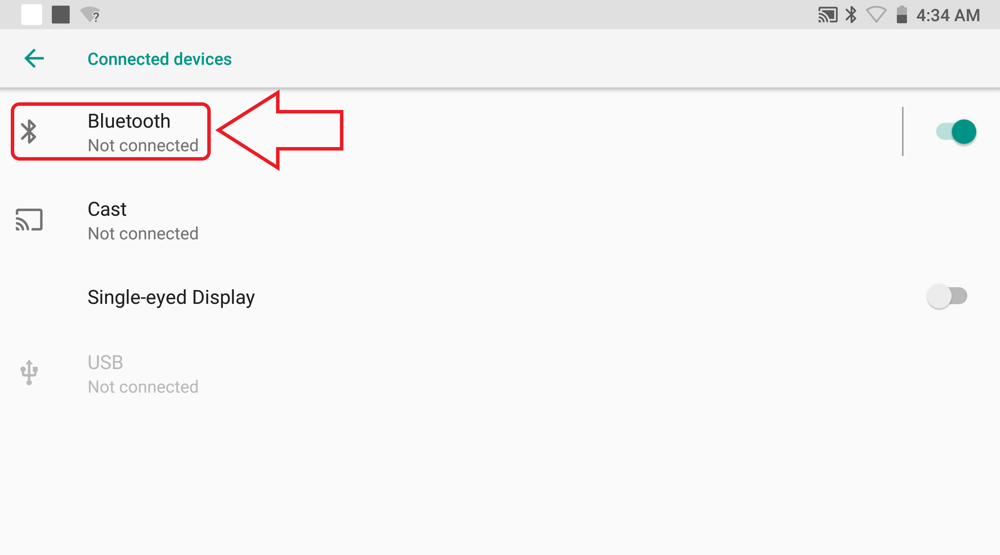
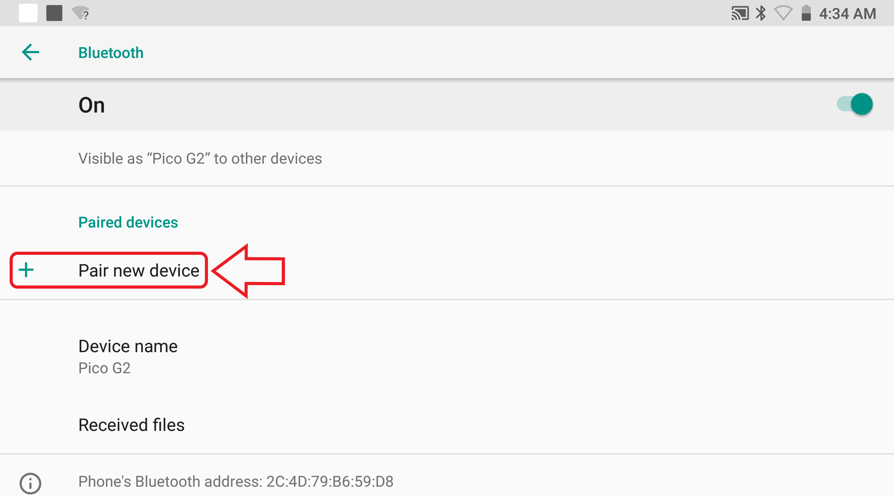
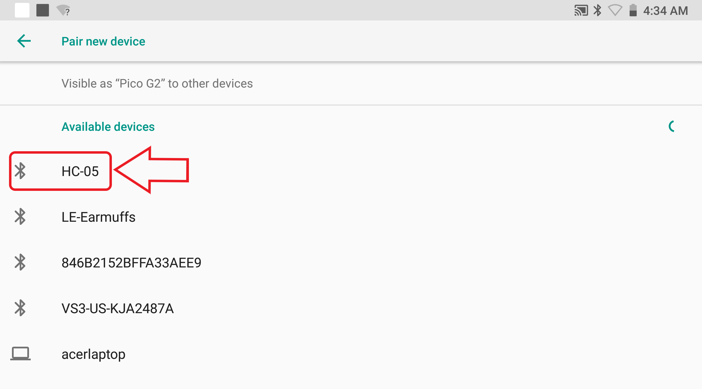
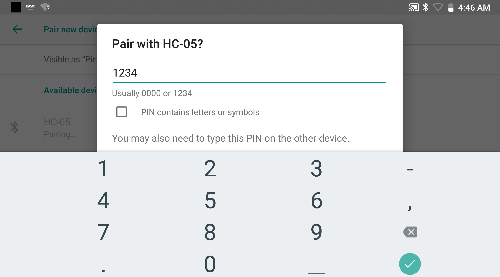

# Pico-Arduino Bluetooth Communication
This documentation provides a system overview, quickstart, and expansion guide for establishing 2-way Bluetooth communication between Arduino and the Pico headset. The included code is a Unity project that works with the example setup, and can be modified modularly to include other Arduino components. 

**Table of Contents**
* [About](#About)
* [Quickstart guide for example setup](#Quickstart-guide-for-example-setup)
	* [Example System Components](#Example-System-Components)
	* [Example Macro System Diagram](#Example-Macro-System-Diagram)
	* [Example Arduino System Diagram](#Example-Arduino-System-Diagram)
	* [Quickstart Steps](#Quickstart-Steps)
* [Implementation Details](#Implementation-Details)
  * [Pico Headset Software](#Pico-Headset-Software)
  	* [Connecting to Bluetooth Device](#Connecting-to-Bluetooth-Device)
	* [Sending Data from Pico to Arduino](#Sending-Data-from-Pico-to-Arduino)
  * [Arduino Software](Arduino-Software)
  	* [Sending data From Arduino to Pico](#Sending-Data-from-Arduino-to-Pico)
	* [Processing Received Arduino Data](#Processing-Received-Arduino-Data)


# About
This guide has been built with the following software versions:
* Arduino - v1.8.12
* Android - v10
* Pico Unity SDK - v2.8.3
* [Bluetooth Classic Library for Unity (TechTweaking) - v3.9](https://github.com/badranX/bt-lib)
* Unity - v2018.4.23f1

# Quickstart guide for example setup
This section provides a quickstart guide for establishing 2-way communication between an Arduino and a Pico Headset using an example system and the code in this repo. The capacitive sensor sends data to the Pico Headset from the Arduino to display whether or not it is pressed, and the Pico Headset sends data to the Arduino to trigger the vibration motor.

## Example System Components
The following hardware components are used in this sample setup:
* Pico Hardware
	* Pico Headset
	* Pico Controller
		* 3Dof sensing
		* Controller Buttons
* Arduino Uno System
	* [capacitive sensor](https://www.amazon.com/HiLetgo-TTP223B-Capacitive-Digital-Raspberry/dp/B00HFQEFWQ/ref=sr_1_3?dchild=1&keywords=hiletgo+touch+switch&qid=1594935626&sr=8-3) ([Hardware Documentation](https://store.arduino.cc/usa/arduino-uno-rev3))
	* [haptic feedback driver](https://www.adafruit.com/product/2305) ([Hardware Documentation](https://learn.adafruit.com/adafruit-drv2605-haptic-controller-breakout/arduino-code))
	* [vibration motor](https://www.sparkfun.com/products/8449)
	* [Hc-05 Bluetooth Module](https://www.amazon.com/HiLetgo-Wireless-Bluetooth-Transceiver-Arduino/dp/B071YJG8DR) ([Hardware Documentation](https://www.gme.cz/data/attachments/dsh.772-148.1.pdf))
* External Computer to upload code to Arduino
## Example Macro System Diagram

## Example Arduino System Diagram

## Quickstart Steps
1. Set up the Arduino System as shown in the figure above. The physical setup might look like the picture below: 


Connect the arduino to the computer and upload the code in the Arduino-Bluetooth folder onto the Arduino board. [Make sure that the cables connected to the TX and RX ports on the Arduino are not connected when the code is being uploaded](https://www.quora.com/How-can-I-overcome-upload-error-in-Arduino-Uno), and re-connect them once the code is finished uploading to the Arduino. 


After this step is completed, the bluetooth module LED should be blinking to indicate there is power going to the bluetooth module. Note that the color of the bluetooth LED might differ between HC-05 modules; some bluetooth modules might be blinking green or blue.  
2. Pair the Pico Headset with the powered HC-05 Bluetooth module - navigate to **Settings> Advanced Settings > Bluetooth > Pair Bluetooth**, and select "HC-05" (see screenshots below).







If prompted for a pin, enter "1234":



 To check that the module is paired correctly, the module should appear in the "paired devices" section in bluetooth settings:


The connection to bluetooth will be established in the next step. Make sure that the Pico controller and the HC-05 module are the only devices paired to the Pico Headset for this Quickstart tutorial. The code can be modified to specify a specific device if multiple bluetooth devices are connected (see **Modifying Code** section). 
3. Launch the app by transfering the Arduino-Bluetooth-Controller.apk file onto Pico Headset, and running the file. Once the app starts, the LED on the bluetooth module should change from blinking continously to [pausing between blinks](https://www.youtube.com/watch?v=BXXAcFOTnBo), to indicate that the bluetooth has connected to the headset. After connection has been established to the bluetooth, the UI canvas will indicate when the capacitive button is pressed, and changing the slider will trigger the motor connected to the arduino. 

# Implementation Details
This section goes over the key parts in the Arduino and Pico Headset code. 
## Pico Headset Software
The Arduino-Bluetooth-Controller.apk file for communication from the Pico Headset was built using the Pico-Bluetooth-Unity project folder (see README in the folder for more details). This code can directly be opened as a Unity project from the Unity Hub. The folder structure is similar to the structure from that created by the [Pico VR Quickstart of SDK access guide](https://sdk.picovr.com/docs/sdk/en/chapter_four.html), with some added files for the UI canvas and the bluetooth module. Most of the bluetooth communication code is added in the [VisualController.cs](./Pico-Bluetooth-Unity/Assets/Project/VisualController.cs) file in the **Pico-Bluetooth-Unity > Assets > Projects** folder.
### Connecting to Bluetooth Device
The connection to the HC-05 module is established in the start function in the VisualController.cs file (shown below). If multiple devices are connected and a specific device needs to be specified, the index of the device can be found by iterating through the devices array and printing the name of each device by accessing the ```device.Name ``` variable for each device. Once the index of the specific device is found, it can be used to acess the device from the devices list. 
 
```
//Connect to bluetooth Module
BluetoothDevice[] devices = BluetoothAdapter.getPairedDevices(); //get list of paired devices
device = devices[0]; // assuming no other devices are connected. index might need to be changed if other devices are connected
device.setEndByte(10);
device.normal_connect(true, false);
```

### Sending Data from Pico to Arduino
The ``` Adjust_HapFeedback ``` function in the VisualController.cs file is called whenever the value is changed for the slider on the UI canvas in the Headset - this was done by [linking the slider in Unity with the ```OnValueChanged() ``` function](https://www.youtube.com/watch?v=HQ8Tttcksu4&t=4s). The function converts the interger character given by the slider to the ASCII byte representation, and sends the byte array to the bluetooth module (more bytes can be added to the array if multiple characters are sent each iteration). 
```
public void Adjust_HapFeedback(System.Single intensity)
{
//convert byte to ascii and send
byte intensity_ascii = (byte)intensity.ToString()[0];
device.send(new byte[]{ intensity_ascii}); //send byte array to bluetooth device
}
```

## Arduino Software
### Sending Data from Arduino to Pico
Data is sent from Arduino in the [Arduino-bluetooth.ino](./Arduino-bluetooth/Arduino-bluetooth.ino) file in the Arduino-bluetooth folder. The sent data can be changed by modifying the input to the ```Serial.print()``` function in the ```loop()``` function: 
```
  if (g_ButtonState){ // if cap button is pressed
      Serial.print(2);
      Serial.print("\n"); //send \n because it was set as the token delineator for the Pico headset
      
  }
  else{
    Serial.print(3); //if cap button is not pressed
    Serial.print("\n");
  }
```
### Processing Received Arduino Data
The Pico headset processes the data using the ```ReadArduinoData()``` method in the VisualController.cs file. The ```Serial.print()``` function from the Arduino in the above section sends a byte array to the Pico Headset. This byte array is converted to ASCII representation, and the ```Bluetooth.text variable``` is changed to match the state of the capacitive button, which is in turn updated in the UI canvas. 
```
public string ReadArduinoData()
{
// Read if data is available from Arduino
byte[] msg = Controller.UPvr_GetCapacative_button(device);
if ((msg != null) && (msg.Length > 0))
{
    //Convert ASCII Byte array to literal string
    string content = System.Text.ASCIIEncoding.ASCII.GetString(msg);

    //Decode literal string
    if (content.Contains("3")) 
    {
	return "not pressed";
    }
    else if (content.Contains("2"))
    {
	return "pressed";
    }

}

 return Bluetooth.text; //UI text is unchanged if no new information is received

}
```
